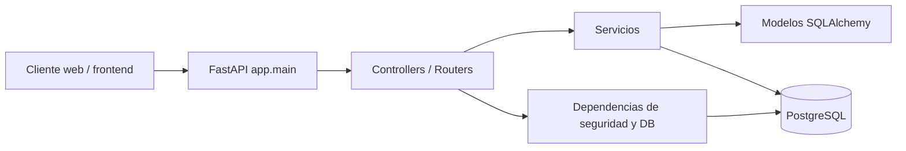

# Arquitectura del Backend

## Vista general

La API usa una arquitectura por capas con separación entre entrada HTTP, lógica de negocio, acceso a datos y esquemas de validación.

## Estructura relevante

| Carpeta / archivo          | Rol                                                   |
| -------------------------- | ----------------------------------------------------- |
| `app/main.py`              | Entry point de FastAPI; registra CORS y routers       |
| `app/core/config.py`       | Configuración basada en variables de entorno          |
| `app/core/database.py`     | Engine SQLAlchemy, sesión y base declarativa          |
| `app/core/dependencies.py` | Dependencias `get_current_user` y `get_current_admin` |
| `app/core/security.py`     | Hash de contraseñas y JWT                             |
| `app/api/controllers/`     | Capa HTTP con routers                                 |
| `app/services/`            | Lógica de negocio                                     |
| `app/models/`              | Modelos ORM                                           |
| `app/schemas/`             | Pydantic models para requests/responses               |
| `backend/sql/`             | Scripts SQL usados por Docker/DB                      |

## Entry point y arranque

| Elemento                 | Valor                                                     |
| ------------------------ | --------------------------------------------------------- |
| Entry point              | `app.main:app`                                            |
| Servidor local           | `uvicorn`                                                 |
| Inicialización de tablas | `Base.metadata.create_all(bind=engine)` al iniciar la app |

## Seguridad

| Mecanismo     | Detalle                                               |
| ------------- | ----------------------------------------------------- |
| Autenticación | `HTTPBearer` con token `Authorization: Bearer ...`    |
| Tokens        | JWT firmado con `SECRET_KEY` y `ALGORITHM`            |
| Contraseñas   | `bcrypt` vía `passlib`                                |
| Autorización  | Dependencias `get_current_user` y `get_current_admin` |

## CORS

Orígenes permitidos detectados en el código:

| Origen                            | Observación                   |
| --------------------------------- | ----------------------------- |
| `http://localhost:4200`           | Desarrollo local del frontend |
| `http://127.0.0.1:4200`           | Desarrollo local alternativo  |
| `https://goltech.mundoalonzo.com` | Despliegue existente          |
| `FRONTEND_URL`                    | Configuración por entorno     |

## Persistencia

La conexión se construye a partir de `DATABASE_URL`, derivada de `DB_HOST`, `DB_PORT`, `DB_NAME`, `DB_USER` y `DB_PASSWORD`. La sesión se maneja con `SessionLocal` y `get_db()`.

## Observaciones

- `test_connection.py` existe como verificación manual de conexión, pero no reemplaza una suite automatizada.
- Si existen middlewares adicionales fuera de `main.py`, no quedaron visibles en los archivos revisados.
