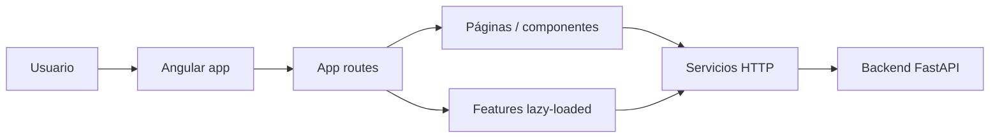

# Arquitectura del Frontend

## Vista general

La aplicación usa componentes standalone y routing por carga diferida. La capa de servicios se apoya en `HttpClient` y en variables de entorno para apuntar al backend.

## Estructura relevante

| Ruta                    | Rol                                        |
| ----------------------- | ------------------------------------------ |
| `src/app/app.ts`        | Componente raíz                            |
| `src/app/app.routes.ts` | Rutas principales                          |
| `src/app/app.config.ts` | Proveedores globales                       |
| `src/app/core/`         | Interceptores y utilidades compartidas     |
| `src/app/features/`     | Funcionalidades cargadas por módulo lógico |
| `src/app/pages/`        | Vistas y pantallas                         |
| `src/app/services/`     | Servicios HTTP de dominio                  |
| `src/environments/`     | Configuración por entorno                  |

## Routing

| Área                 | Rutas principales                                                                                                   |
| -------------------- | ------------------------------------------------------------------------------------------------------------------- |
| Autenticación        | `login`, `registro`, `olvido-contrasenia`, `reset-password`                                                         |
| Navegación principal | `dashboard`, `ligas`, `invitaciones`, `perfil`, `vaticinios`, `clasificacion/liga/:idLiga`                          |
| Administración       | `admin/usuarios`, `admin/dashboard-global`, `admin/auditoria`, `admin/reportes`, `admin/premios`, `admin/mundial/*` |

## Estado y seguridad

| Elemento           | Estado                                                                    |
| ------------------ | ------------------------------------------------------------------------- |
| Guards de ruta     | No se encontraron archivos de guard en `src/app`                          |
| Interceptor HTTP   | Sí: `auth.interceptor.ts` agrega `Authorization: Bearer ...` si hay token |
| Persistencia local | `localStorage` y `sessionStorage` para tokens y usuario                   |

## Integración HTTP

Los servicios consumen el backend mediante `environment.apiUrl` y `environment.apiBaseUrl`. La mayoría de llamadas usan rutas bajo `/api/...` y algunas operaciones del área de vaticinios usan el host base directamente.
